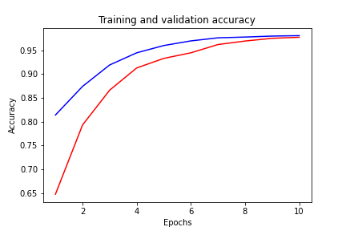
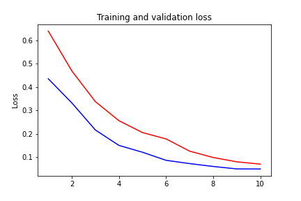

<h1> Competition Description </h1>
<p1>Twitter has become an important communication channel in times of emergency.
The ubiquitousness of smartphones enables people to announce an emergency they’re observing in real-time. 
Because of this, more agencies are interested in programatically monitoring Twitter (i.e. disaster relief organizations and news agencies).</p1>
  

  
  
  
  

